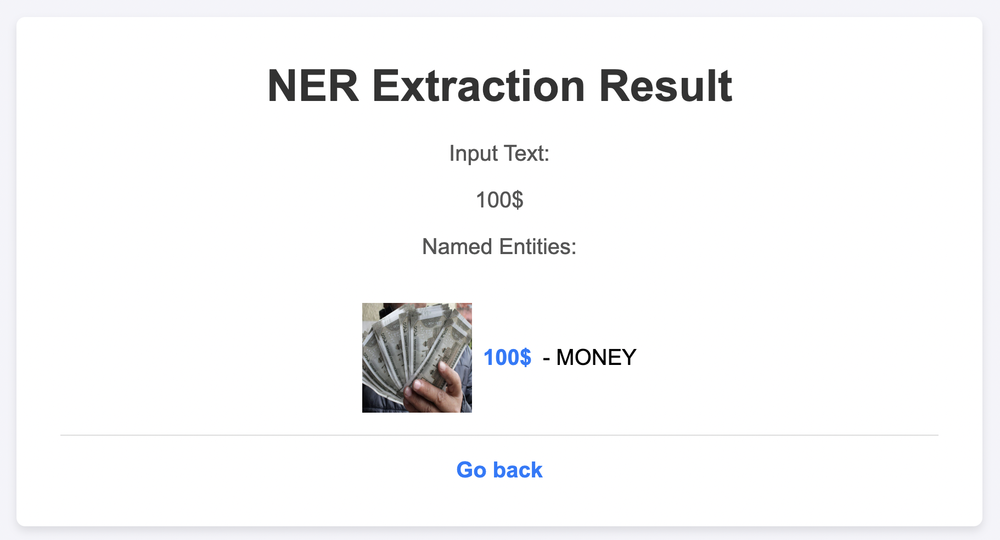

# NER Flask Spacy Project

This project is a Flask web application that performs Named Entity Recognition (NER) using the spaCy library. It uses the Kaggle Fake News Dataset for testing.

## Setup

### Prerequisites

Before you begin, ensure you have met the following requirements:
- Python 3.x installed
- `pip` installed
- (Optional but recommended) A virtual environment set up

### Installation

1. **Clone the repository**:
   
   ```bash
   git clone https://github.com/Pragya-Pandey2709/NER_Flask_Spacy.git
   cd NER_Flask_Spacy
   ```

3. **Create a virtual environment** (optional but recommended):
   ```bash
   python -m venv myenv1
   source myenv1/bin/activate  # On Windows use `myenv\Scripts\activate`
   ```

4. **Install the required packages**:
   ```bash
   pip install -r requirements.txt
   ```

5. **Download the spaCy language model**:
   ```bash
   python -m spacy download en_core_web_sm
   ```

6. **Download and extract the Kaggle Fake News Dataset** to the project directory.

## Running the Flask Application

1. **Start the Flask server**:
   ```bash
   python app.py
   ```

2. **Open your web browser and go to** [http://localhost:5000](http://localhost:5000).

## Usage

- Input text excerpts from the Kaggle Fake News Dataset into the text area on the main page.
- Submit the form to extract named entities.
- View the extracted named entities on the results page.

## Project Structure

```
├── app.py               # The main Flask application file
├── requirements.txt     # List of required packages
├── templates            # Directory for HTML templates
│   ├── index.html       # The main page template
│   └── result.html      # The results page template
├── README.md            # This README file
├── static               # Directory for static files (CSS, JavaScript, images)
│   └── style.css        # CSS file for styling
├── data                 # Directory for the dataset (to be created and populated)
│   ├── fake.csv         # Fake news dataset (example)
│   └── true.csv         # True news dataset (example)
```
## Images of result 

### Welcome message page 

###  Input page

###  Result message page 

###  Person result page 

###  Location result page 

###  GPE result page 

###  Money result page 

###  Ordinal result page 

###  Organisation result page 

###  Percent result page 

###  Quantity result page 

###  Time result page 


## License

This project is licensed under the MIT License - see the LICENSE file for details.

By following these instructions, you will be able to set up the Python environment and run the Flask application for the NER extraction project using the Kaggle Fake News Dataset.
